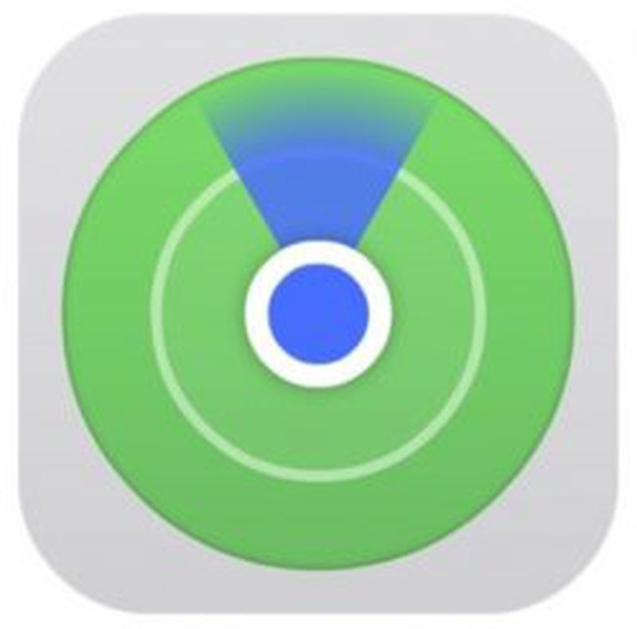
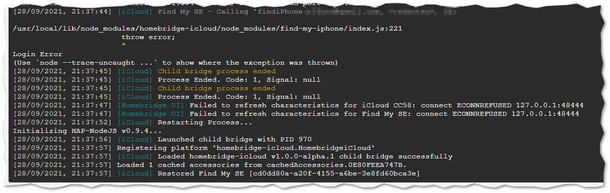

<p align="center">
    <a href="https://homebridge.io/"></a>
</p>

[](https://github.com/steveredden/homebridge-icloud/blob/main/LICENSE)
[](https://github.com/steveredden/homebridge-icloud)
[](https://GitHub.com/steveredden/homebridge-icloud/issues/)
[](https://npmjs.com/package/homebridge-icloud)
[](https://www.npmjs.com/package/homebridge-icloud)

# homebridge-icloud

`homebridge-icloud` is a [Homebridge](https://homebridge.io) plugin that exposes your Apple devices to [Apple's](https://www.apple.com) [HomeKit](https://www.apple.com/ios/home) smart home platform as stateless switches, which when turned on, actiave the "Find my Device" functionality.



## Use Cases

This plugin is designed to expose a button that assists in finding one's phone or other devices. The "Find my Phone" features of iCloud bypass any `Do not Disturb` or `Silent` settings on the phone, and plays an audible chime. Ideally, the buttons are to be triggered by Alexa (thanks, of course, to [homebridge-alexa](https://github.com/NorthernMan54/homebridge-alexa)), as an alternative to constantly asking [her] to `call my phone` - which, if on silent, may not be easily found. An Alexa Routine triggers the switch:

<p align="center"></p>

## Installation Instructions

#### Option 1: Install via Homebridge Config UI X

Search for "icloud" in [homebridge-config-ui-x](https://github.com/oznu/homebridge-config-ui-x) and install `homebridge-icloud`.

#### Option 2: Manually Install

```sh
sudo npm install -g homebridge-icloud
```

## Configuration

Device names (labels) can be found in your "Find My" app in the Devices tab

### Example

```json
platforms: [
    {
        "platform": "HomebridgeiCloud",
        "username": "you@apple.com",
        "password": "yourPassword",
        "devices": [
            "iPhone SE",
            "iPhone 13"
        ],
        "name": "iCloud",
        "debug": false
    }
]
```

* **platform** (mandatory): the name of the plugin
* **username** (mandatory): your Apple iCloud username
* **password** (mandatory): your Apple iCloud password
* **devices** (mandatory): array containing your devices' labels
  * **\<label\>** (mandatory): the name of your accessory
* *name* (optional): platform name to display in logs
* *debug* (optional): boolean to enable more verbose logging

## Limitations

This plugin relies on the npmjs package ["find-my-iphone" v1.1.2](https://www.npmjs.com/package/find-my-iphone), which does not appear to support App-specific passwords. Similarly, it does not provide a great way to catch login errors, and the platform will restart.  It is **highly** recommended to run this as a [child bridge](https://github.com/homebridge/homebridge/wiki/Child-Bridges), so that you do not impact other plugins!



<br><hr><br>
<p align="center">
    <a href="https://buymeacoffee.com/steveredden"></a>
</p>
